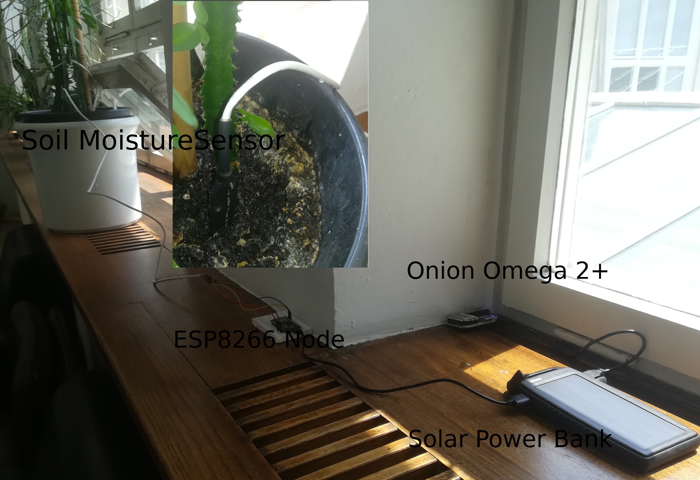

# ESP8266 Soil Moisture Node

## Overview

This is a quick and dirty Proof of Concept project. We used a Chirp I²C connected soil moisture sensor to measure the water content in a flower pod. The device is read by a ESP8266 module, the firmware can be found in the [esp8266_log_chirp_to_omega](https://github.com/KIT-HYD/esp8266-sketches/tree/master/esp8266_log_chirp_to_omega) firmware folder, which can be loaded to the module using the Arduino software. You will have to adjust the WiFi SSID, Omega device name and the WiFi password to make it work with your actual Omega. 

The data is sent to a Onion Omega 2+ module, that runs a bottle.py based webserver software called [omega-logserver](https://github.com/KIT-HYD/omega-logserver). The whole setup is powered by the cheapest solar driven power bank we could find. We will add some data once produced.
